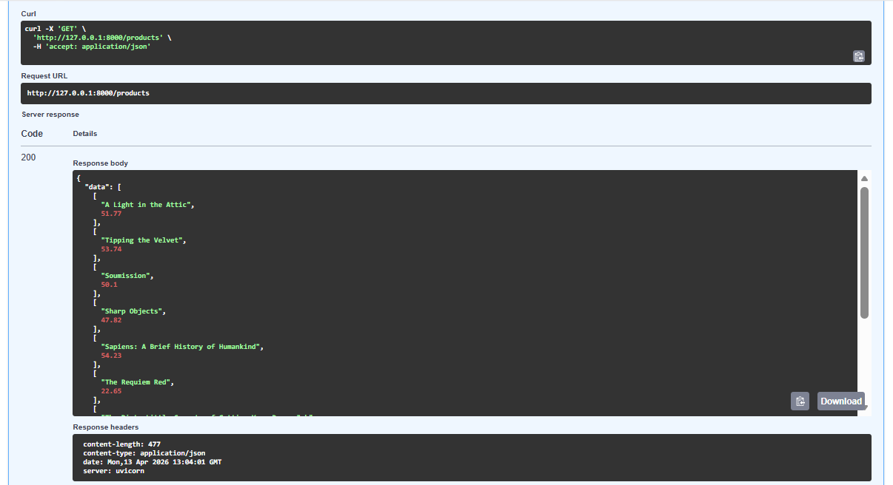

# 🚀 Web Data Automation Pipeline

## 📌 Overview

This project is an end-to-end web data automation system that extracts data from websites, processes it, stores it in a database, and exposes it through an API.

---

## ⚙️ Features

* Automated web scraping using Playwright
* Data cleaning and validation using pandas
* SQLite database storage
* FastAPI REST API for data access
* Logging system for monitoring
* Scheduler for automated execution

---

## 🧱 Tech Stack

* Python
* Playwright
* Pandas
* SQLite
* FastAPI

---

## 📁 Project Structure

```
web-data-automation/
│
├── scraper/
│   ├── flipkart_scraper.py
│   ├── validation.py
│   ├── db.py
│   ├── scheduler.py
│   ├── logger.py
│
├── api.py
├── requirements.txt
├── README.md
```
## 📸 Screenshots


---

## 🚀 How to Run

### 1. Clone repository

```
git clone https://github.com/anandpraveen71/web-data-automation.git
cd web-data-automation
```

### 2. Create virtual environment

```
python -m venv venv
venv\Scripts\activate
```

### 3. Install dependencies

```
pip install -r requirements.txt
playwright install
```

### 4. Run scraper

```
python scraper/flipkart_scraper.py
```

### 5. Run API

```
uvicorn api:app --reload
```

Open in browser:

```
http://127.0.0.1:8000/docs
```

---

## 📸 Output

* Extracted data stored in CSV
* Cleaned data saved after validation
* Data stored in SQLite database
* API endpoint returns JSON response

---

## 🎯 Result

Built a fully automated pipeline for extracting, processing, storing, and serving data using modern backend technologies.
